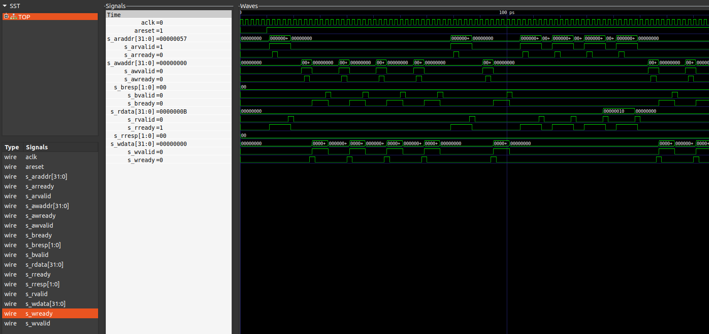

# verilator-simulations

This repository contains System Verilog based designs verified using C++ based testbenches with Verilator

The Testbench is implemented with layered architecture similar to UVM style testbench.

## Software requirements

| Software | Description | Version Tested |
|----------|-------------|-----------------|
| Verilator | HDL simulation and verification | 4.216 |
| GTKWave | Timing diagram visualization | 3.3.103 |
| GCC | C++ compilation | 9.4.0 |
| CMake | Build system generator | 4.2.1 |
| Ubuntu | Linux distribution | 20.04 LTS |

## Repository layout

    ahb/             – AHB slave example
    ├─ ahb_params.svh
    ├─ ahb_operations.sv
    ├─ ahb_slave.sv
    ├─ tb_ahb_slave.cpp
    └─ Makefile
    
    axi-lite/        – AXI‑Lite slave example
    ├─ axi_slave.sv
    ├─ tb_axi_slave.cpp
    └─ Makefile

## Procedure

1. Clone the repository.
2. Navigate to either the axi-lite or ahb directory.
3. Verilate, Build and Simulate the model using the following commands:

```
make verilate
```

```
make build
```

```
make waves
```

4. The build data can be cleaned using following command:

```
make clean
```

## Post simulation

1. The waveform is visualized using GTKWave

    **Figure 1:** AHB slave simulation waveform
    

    **Figure 2:** AXI-lite slave simulation waveform
    

2. The simulation logs are printed in **sim_logs.log** file. 

3. [Example log file](./sim_logs.log) for AHB-slave simulation

4. Glimpse of simulation logs:

```text
[SIM]: ###### Reset DUT #######
[GEN]: OP: 1 ADDR: 70 WDATA: 25 HSIZE: 1 HBURST: 4 NUM BURSTS: 4
[DRV]: OP: 1 ADDR: 70 HTRANS: 2 WDATA: 78
[MON]: OP: 1 ADDR: 70 WDATA: 78 RDATA: 0 HRESP: 0
[SCO]: Scoreboard report Operation: 1 TOTAL BURSTS RECEIVED: 8 PASS: 8 FAIL: 0
[SIM]: ###### SIMULATION ENDED #######
```
