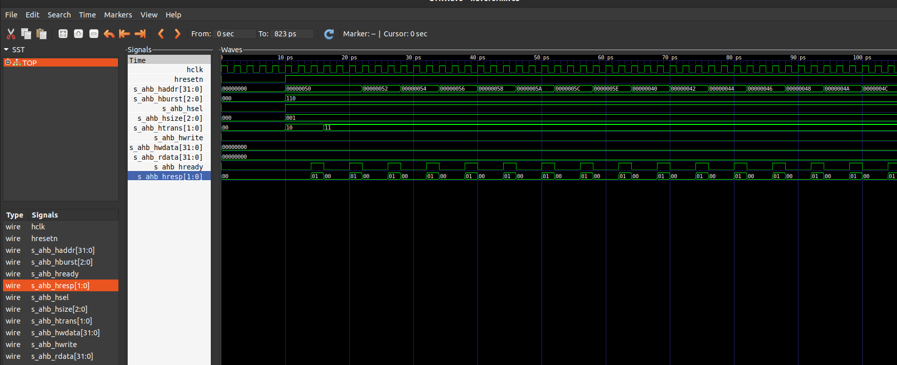

# verilator-simulations

This repository contains System Verilog based designs verified using C++ based testbenches with Verilator

The Testbench is implemented with layered architecture similar to UVM style testbench.

## Software requirements

- verilator: For design verification and simulation
- GTKWave: Timing diagram visualization
- GCC: Compiling C++ source code.
- Cmake: For building Makefiles


## Procedure

1. Clone the repository.
2. Navigate to either the axi-lite or ahb directory.
3. Verilate, Build and Simulate the model using the following commands:

```
make verilate
```

```
make  build
```

```
make waves
```

## Post simulation

1. The waveform is visualized using GTKWave

    **Figure 1:** AHB slave simulation waveform
    


2. The simulation logs are printed in **sim_logs.log** file.
